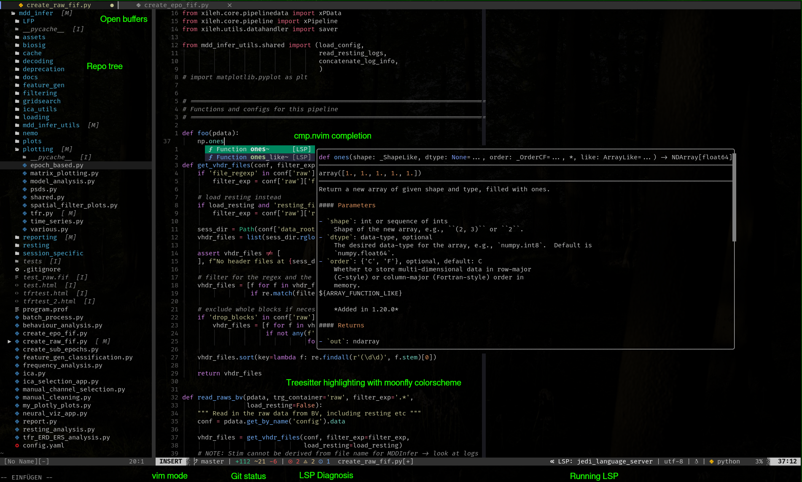
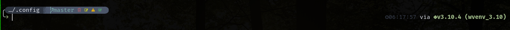

# My `.config/`
This is only the essential config folders I plan to share accross all machines.
Note that every config needs to be whitelisted in the `.gitignore` manually as I want to ignore everything by default.

#### Nvim
The by far most significant config in here is for [neovim](./nvim/README.md) which I use as my editor of choice for everything.

#### Starship
Some minur config also went into the starhship promt, which is much easier to handle and more performant than the powerline I used before.

