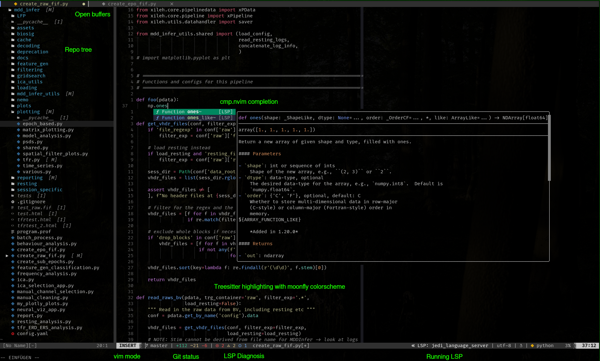

# Start
My nvim journey started of this one in 2021:
* https://www.youtube.com/watch?v=6F3ONwrCxMg

but has evolved quite a bit since and currently looks like this:

# General structure
I tried to setup as much as possible in lua -> see `./lua` folder. Every module
with a customized setup is placed in a folder prefixed by `c_*`.

Only things I could not manage to setup in lua ended up under `./vim`, such as
a few specific highlightings or the PDF preview for tex files.

## Plugins and install
Plugins are managed via [packer](https://github.com/wbthomason/packer.nvim) which can bootstrap itself :)!

For specified plugins see `./lua/plugins.lua` and install them via `:PackerInstall`. If a plugin from the `./lua/plugins.lua` file is removed, you would want to run `:PackerSync`.

*Note*: Some other modules require to have installations for specific languages, e.g. installing the appropriate LSPs via `:LspInstall python` or `:TsInstall python` for better syntax highlighting using treesitter.
